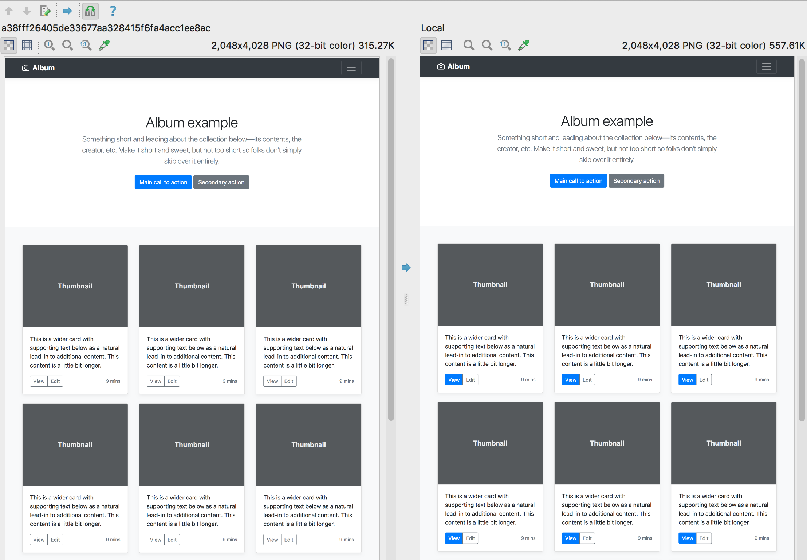

##Screenshot (regression) UI testing with Node.js, using puppeteer and pixelmatch

[![Sponsored](https://img.shields.io/badge/chilicorn-sponsored-brightgreen.svg?logo=data%3Aimage%2Fpng%3Bbase64%2CiVBORw0KGgoAAAANSUhEUgAAAA4AAAAPCAMAAADjyg5GAAABqlBMVEUAAAAzmTM3pEn%2FSTGhVSY4ZD43STdOXk5lSGAyhz41iz8xkz2HUCWFFhTFFRUzZDvbIB00Zzoyfj9zlHY0ZzmMfY0ydT0zjj92l3qjeR3dNSkoZp4ykEAzjT8ylUBlgj0yiT0ymECkwKjWqAyjuqcghpUykD%2BUQCKoQyAHb%2BgylkAyl0EynkEzmkA0mUA3mj86oUg7oUo8n0k%2FS%2Bw%2Fo0xBnE5BpU9Br0ZKo1ZLmFZOjEhesGljuzllqW50tH14aS14qm17mX9%2Bx4GAgUCEx02JySqOvpSXvI%2BYvp2orqmpzeGrQh%2Bsr6yssa2ttK6v0bKxMBy01bm4zLu5yry7yb29x77BzMPCxsLEzMXFxsXGx8fI3PLJ08vKysrKy8rL2s3MzczOH8LR0dHW19bX19fZ2dna2trc3Nzd3d3d3t3f39%2FgtZTg4ODi4uLj4%2BPlGxLl5eXm5ubnRzPn5%2Bfo6Ojp6enqfmzq6urr6%2Bvt7e3t7u3uDwvugwbu7u7v6Obv8fDz8%2FP09PT2igP29vb4%2BPj6y376%2Bu%2F7%2Bfv9%2Ff39%2Fv3%2BkAH%2FAwf%2FtwD%2F9wCyh1KfAAAAKXRSTlMABQ4VGykqLjVCTVNgdXuHj5Kaq62vt77ExNPX2%2Bju8vX6%2Bvr7%2FP7%2B%2FiiUMfUAAADTSURBVAjXBcFRTsIwHAfgX%2FtvOyjdYDUsRkFjTIwkPvjiOTyX9%2FAIJt7BF570BopEdHOOstHS%2BX0s439RGwnfuB5gSFOZAgDqjQOBivtGkCc7j%2B2e8XNzefWSu%2BsZUD1QfoTq0y6mZsUSvIkRoGYnHu6Yc63pDCjiSNE2kYLdCUAWVmK4zsxzO%2BQQFxNs5b479NHXopkbWX9U3PAwWAVSY%2FpZf1udQ7rfUpQ1CzurDPpwo16Ff2cMWjuFHX9qCV0Y0Ok4Jvh63IABUNnktl%2B6sgP%2BARIxSrT%2FMhLlAAAAAElFTkSuQmCC)](http://spiceprogram.org/oss-sponsorship)


This is example on how to use automated testing for your web app using two main components:
- [puppeteer](https://github.com/GoogleChrome/puppeteer) (Headless Chrome Node API)
- [pixelmatch](https://github.com/mapbox/pixelmatch) (The smallest, simplest and fastest JavaScript pixel-level image comparison library)

Requires Node.js installed.

Clone repo and run ```npm install``` to install all the dependecies

Configure your settings in [config](./config.js) file and run

```npm start```

In case you don't have any site running you can use my example-website made with Bootstrap.

You need to install [http-server](https://github.com/indexzero/http-server) if you don't have it ```npm install http-server -g``` 

Then just run ```http-server example-website```

Files are stored as pngs.

Usual workflow:

1. Create initial screenshots running the ```npm start```
2. Commit your current state with git
3. Make any visual change on your website (css or content)
4. Run ```npm start``` again
5. Only the changed screens will be replaced and you can commit them together with your actual change 


You can then compare images easily with git:



Needless to say that your content has to be static and predictable, slightest running animation caught in different position can show false positives for change in UI.